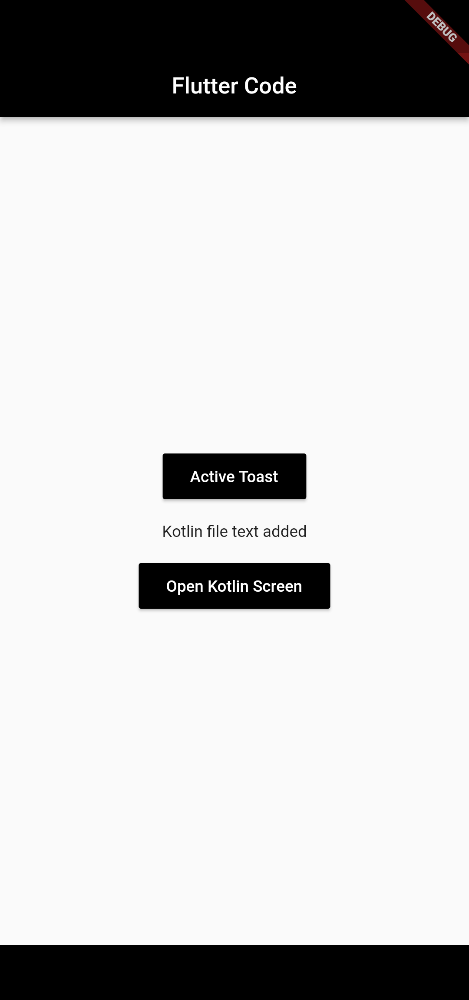
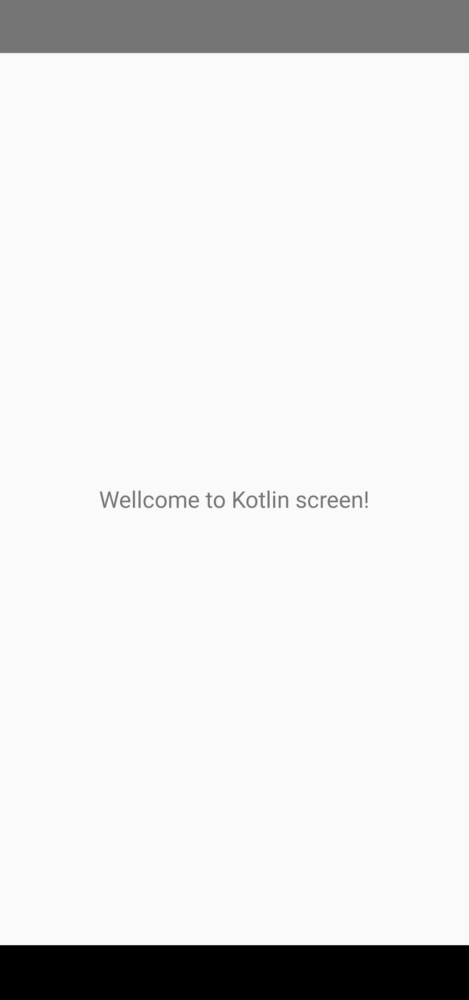

<h1 align="center">Flutter with Kotlin</h1>

    
    

    
    <!--  -->
    

    <a href="#features" style="color:#000000;">Features</a> &#xa0; | &#xa0; 
    <a href="#dependencies" style="color:#000000;">Dependencies</a> &#xa0; | &#xa0;
    <a href="#contact" style="color:#000000;">Contact</a> &#xa0; | &#xa0;
    <a href="#license" style="color:#000000;">License</a>

This project was created just to study how the integration of native codes (Kotlin) into a multiplatform application (Flutter) works.

## Features

- [x] **Call native code:** Flutter calls kotlin toast message.
- [x] **Navigation:** Flutter navigate to Kotlin Screen.

### Demo

<table align="center">
   <tr>
      <td></td>
      <td></td>
  </tr>
</table>

## Dependencies

This project was created using: 
- Dart 2.16.2
- Flutter 2.10.5
- Java 11.Y.Z
- Android Studio Girafe 2022.3.1 Patch 2

## Contact

If you have any questions or suggestions about the project, please feel free to contact us. You can find me at LinkedIN. Thank you for your interest and support for the project!

- Contact me through my personal LinkedIn profile.

  

## License

This project is public and has the MIT Licenses. It is open for licensing and distribution or modification without prior notice.